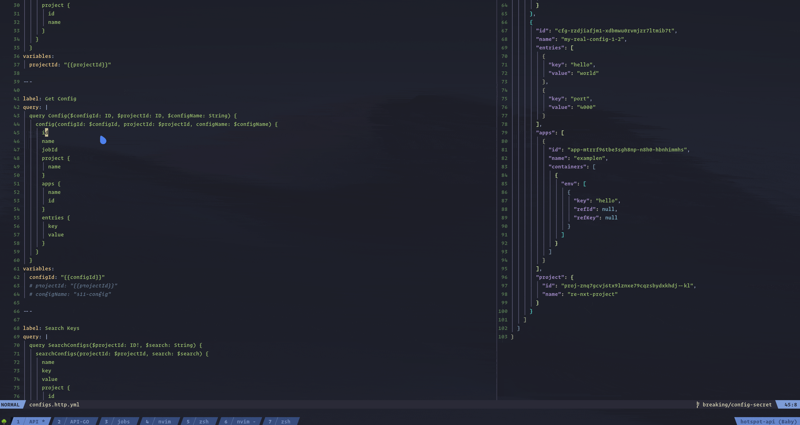

## grapqhl client to speed up grapqhl query/mutation development



## How You should use it (For Neovim Users)

- Add this line in your nvim(0.5+) configuration, it would create a command `Gql`
```lua
vim.cmd [[
  command! -nargs=0 Gql  execute 'vne | setlocal buftype=nofile | setlocal bufhidden=hide | setlocal noswapfile | set ft=json | r! node --es-module-specifier-resolution=node <where-you-cloned>/src/index.js' . ' '. expand('%:p') . ' gqlenv.json'. ' '. line('.')
]]
```

- then, while editing graphql-cli yml file, on the yaml block that you want to make grapqhl call for, do `:Gql`, and the response would come to you in a vertical split next to you

## How to Use

- You should create a gqlenv.json file in your project root directory, something like this
```jsonc
{
  "mode": "dev", // could be anything you define below, here dev|prod
  "dev": {
    // variables while making requests in dev mode
    "url": "<graphql endpoint>",
    "name": "sample",
  },
  "prod": {
    // variables while making requests in prod mode
    "url": "<production grapqhl endpoint>",
    "name": "prod-sample"
  }
}
```

- then, create a file `$filename.yml` file
```yaml
# filename: auth-graphql.yml

---
global:
  email: "sample@gmail.com"

----
query: |
  mutation Login($email: String!, $password: String!) {
    auth {
      login(email: $email, password: $password) {
        id
        userId
        userEmail
      }
    }
  }

variables:
  email: "{{email}}" # this is variable parsing, from either 'gqlenv.json' or from 'global' doc at the top
  password: "hello"  
```

- now, execute it
```sh
pnpm start -- $filename $envFileName $lineNumber
```


## Inspired By
.http file based REST Client in [Neovim/vim](https://github.com/bayne/vim-dot-http) and Intellij

## Next To Come

- [ ] Neovim plugin that could just setup the previous step for you
- [x] i don't know now 😂
